# x402 AWS Enterprise Demo

HTTP 402 payment-gated content delivery using AWS Bedrock AgentCore and Coinbase AgentKit.

## Overview

This project demonstrates a payment-gated content delivery system using the [x402 protocol](https://github.com/coinbase/x402):

- **Payer**: AI agent on Bedrock AgentCore Runtime with Coinbase AgentKit wallet
- **Seller**: CloudFront + Lambda@Edge for x402 payment verification
- **Web UI**: React demo interface

## Architecture

```mermaid
flowchart LR
    Browser["🌐 Browser"]

    subgraph AWS["AWS Account"]
        direction LR

        subgraph WebUI["web-ui-infrastructure"]
            direction TB
            CF_UI["Amazon CloudFront"]
            S3_UI["Amazon S3\n(React App)"]
            APIGW["Amazon API Gateway\n(REST, 29s timeout)"]
            Lambda_Proxy["AWS Lambda\n(Python 3.12 Proxy)"]
            CF_UI --> S3_UI
            APIGW --> Lambda_Proxy
        end

        subgraph Payer["payer-infrastructure"]
            direction TB
            subgraph AgentCore["Amazon Bedrock AgentCore"]
                direction TB
                Gateway["Gateway\n(MCP Tool Server, IAM SigV4)"]
                Runtime["Runtime\n(Session Management)"]
                Agent["Strands Agent\n(Python)"]
                Wallet["AgentKit Wallet\n(CDP, EIP-3009)"]
                Gateway --> Runtime
                Runtime --> Agent
                Agent --> Wallet
            end
            Bedrock["Amazon Bedrock\n(Claude Sonnet)"]
            Secrets["AWS Secrets Manager\n(CDP Credentials)"]
            CW["Amazon CloudWatch\n(Dashboards, Alarms)"]
            S3_Spec["Amazon S3\n(OpenAPI Spec)"]
            Agent --> Bedrock
            Agent --> Secrets
            Gateway --> S3_Spec
        end

        subgraph Seller["seller-infrastructure"]
            direction TB
            CF_Seller["Amazon CloudFront\n(x402 Payment-Gated)"]
            LambdaEdge["Lambda@Edge\n(Payment Verifier,\nNode.js 20.x, us-east-1)"]
            S3_Content["Amazon S3\n(Content Bucket)"]
            CF_Seller --> LambdaEdge
            LambdaEdge -->|"Valid payment"| S3_Content
            LambdaEdge -->|"No payment"| FourOhTwo["402 Response\n+ x402 Headers"]
        end
    end

    Facilitator["x402 Facilitator\n(x402.org)"]
    Blockchain["Base Sepolia\n(USDC Testnet)"]
    CDP["Coinbase Developer\nPlatform API"]

    Browser -->|"HTTPS"| CF_UI
    Browser -->|"API Calls"| APIGW
    Lambda_Proxy -->|"InvokeAgentRuntime"| Runtime
    Agent -->|"HTTPS +\nx402 Headers"| CF_Seller
    LambdaEdge -->|"Verify & Settle"| Facilitator
    Facilitator -->|"On-chain\nSettlement"| Blockchain
    Wallet -->|"Wallet Ops"| CDP
    Lambda_Proxy -->|"eth_call\n(Balance)"| Blockchain
```



Three CDK stacks deploy into a single AWS account:
- **web-ui-infrastructure** — CloudFront + S3 for the React app, API Gateway + Lambda proxy to AgentCore
- **payer-infrastructure** — IAM roles, Secrets Manager, CloudWatch observability for Bedrock AgentCore (Runtime, Gateway, Agent)
- **seller-infrastructure** — CloudFront + Lambda@Edge for x402 payment-gated content, S3 content bucket

AgentCore Gateway acts as an MCP tool server:
- Content endpoints exposed as discoverable MCP tools via OpenAPI spec
- Agent discovers tools at runtime via MCP protocol
- x402 payment headers pass through to CloudFront
- Agent handles 402 responses and payment signing

## Payment Flow

The Web UI guides users through a 3-step payment process:

1. **Step 1: Request Content**
   - User selects content item
   - Agent requests content from CloudFront
   - Lambda@Edge returns `402 Payment Required` with x402 headers
   - Agent analyzes payment requirements and reports back

2. **Step 2: Confirm Payment**
   - User confirms payment
   - Agent signs payment with AgentKit wallet (EIP-3009)
   - Agent retries request with `X-PAYMENT` header
   - Lambda@Edge verifies signature via x402 facilitator
   - Facilitator settles payment on-chain
   - Agent confirms successful payment

3. **Step 3: View Content**
   - User clicks to view purchased content
   - Agent presents the content data in readable format
   - Transaction hash available for block explorer verification

## Stack

| Component | Technology |
|-----------|------------|
| Agent Framework | [Strands Agents SDK](https://strandsagents.com/) (Python) |
| Agent Runtime | [Amazon Bedrock AgentCore](https://docs.aws.amazon.com/bedrock-agentcore/) |
| Tool Discovery | MCP Protocol via Gateway |
| LLM | Amazon Bedrock (Claude Sonnet) |
| Wallet | [Coinbase AgentKit](https://docs.cdp.coinbase.com/agentkit/) |
| Content Delivery | CloudFront + Lambda@Edge |
| Payment Protocol | [x402](https://github.com/coinbase/x402) |
| Network | Base Sepolia (testnet) |
| Web UI | React + Vite + TypeScript |

## Project Structure

```
x402-agentcore-demo/
├── payer-agent/              # AI Agent (Python) - Strands agent with AgentKit wallet
│   ├── agent/                # Agent implementation & tools
│   ├── openapi/              # OpenAPI specs for Gateway targets
│   ├── scripts/              # Deployment & test scripts
│   └── tests/                # Test suite (355 tests)
│
├── payer-infrastructure/     # CDK Stack for AgentCore Runtime
│   └── lib/
│       ├── agentcore-stack.ts
│       └── observability-stack.ts
│
├── seller-infrastructure/    # CDK Stack for x402 Payment API ← Agent calls this
│   ├── lib/
│   │   ├── cloudfront-stack.ts
│   │   └── lambda-edge/
│   │       ├── payment-verifier.ts  # x402 payment verification
│   │       └── content-config.ts    # Content & pricing config
│   └── content/              # S3-backed content files
│
├── web-ui/                   # React Frontend (Vite + TypeScript)
│   └── src/
│       ├── api/              # Agent & Gateway clients
│       ├── components/       # UI components
│       └── hooks/            # React hooks
│
├── web-ui-infrastructure/    # CDK Stack for Web UI hosting ← Browser loads this
│   └── lib/
│       ├── web-ui-stack.ts   # CloudFront + S3 + API Gateway
│       └── lambda/           # API proxy for AgentCore
│
├── scripts/                  # Setup & verification scripts
├── docs/                     # Documentation
├── x402/                     # x402 protocol (cloned dependency)
└── agentkit/                 # Coinbase AgentKit (cloned dependency)
```

### Two CloudFront Distributions

This project deploys **two separate CloudFront distributions** for different purposes:

| Stack | CloudFront Purpose | Called By |
|-------|-------------------|-----------|
| `seller-infrastructure` | Payment-gated API (returns 402, verifies payments) | AI Agent |
| `web-ui-infrastructure` | Static React app hosting | Browser |

The Web UI (browser) → Agent → Seller API for ease of use.

### Deployed URLs

After deployment, you'll have URLs for each component:

| Component | URL Pattern | Purpose |
|-----------|-------------|---------|
| Web UI | `https://<distribution-id>.cloudfront.net` | React frontend |
| Content API | `https://<distribution-id>.cloudfront.net` | x402-protected endpoints |
| API Gateway | `https://<api-id>.execute-api.<region>.amazonaws.com/prod/` | AgentCore proxy |

Get your URLs from CDK deployment outputs or CloudFormation console.

### Wallet Addresses (Base Sepolia Testnet)

Wallets are created during setup:

| Role | Source | Description |
|------|--------|-------------|
| Payer (Agent) | CDP API | Created automatically by AgentKit |
| Seller | CDP API or your own | Set `PAYMENT_RECIPIENT_ADDRESS` in `seller-infrastructure/.env` |

To create a seller wallet via CDP, see [Creating a Seller Wallet](#creating-a-seller-wallet) below.

## Agent Tools

Built-in tools:

| Tool | Description |
|------|-------------|
| `get_wallet_balance` | Check wallet balance |
| `analyze_payment` | Analyze payment requirements |
| `sign_payment` | Sign payment (EIP-3009) |
| `request_faucet_funds` | Request testnet tokens |
| `check_faucet_eligibility` | Check if wallet is eligible for faucet |

Service discovery tools:

| Tool | Description |
|------|-------------|
| `discover_services` | Find available paid services from Gateway |
| `request_service` | Request any discovered service by name |
| `list_approved_services` | List pre-approved services for autonomous purchasing |
| `check_service_approval` | Check if a purchase is pre-approved |

MCP tools (discovered via Gateway at `/mcp/tools`):

| Tool | Price (USDC) | Description |
|------|--------------|-------------|
| `get_premium_article` | 0.001 | AI/blockchain article |
| `get_weather_data` | 0.0005 | Weather conditions |
| `get_market_analysis` | 0.002 | Crypto market data |
| `get_research_report` | 0.005 | Blockchain research |
| `get_dataset` | 0.01 | ML dataset |
| `get_tutorial` | 0.003 | Smart contract tutorial |

## Prerequisites

- AWS Account with Bedrock AgentCore access
- [Coinbase Developer Platform](https://portal.cdp.coinbase.com/) API keys
- Node.js 18+, Python 3.10+
- AWS CDK CLI
- Docker (for agent deployment to AgentCore)

See [QUICKSTART.md](QUICKSTART.md) for a streamlined deployment guide.

## Quick Start

### 1. Clone and setup

```bash
git clone https://github.com/joshuamarksmith/x402-agentcore-demo.git
cd x402-agentcore-demo

# Clone dependencies
git clone https://github.com/coinbase/x402.git
git clone https://github.com/coinbase/agentkit.git
```

### 2. Configure credentials

```bash
# Payer agent - set your CDP wallet credentials
cp payer-agent/.env.example payer-agent/.env
# Edit payer-agent/.env → set CDP_API_KEY_ID, CDP_API_KEY_SECRET, CDP_WALLET_SECRET

# Seller infrastructure - set your wallet address
cp seller-infrastructure/.env.example seller-infrastructure/.env
# Edit seller-infrastructure/.env → set PAYMENT_RECIPIENT_ADDRESS
```

### 3. Deploy seller infrastructure

```bash
cd x402-agentcore-demo/seller-infrastructure
npm install
npx cdk bootstrap  # First time only
npx cdk deploy
```

### 4. Sync environment variables

This automatically pulls the CloudFront URL from the seller stack and updates `payer-agent/.env`:

```bash
cd x402-agentcore-demo
./scripts/sync-env.sh
```

### 5. Deploy payer infrastructure

```bash
cd x402-agentcore-demo/payer-infrastructure
npm install
npx cdk bootstrap  # First time only
npx cdk deploy --all
```

### 6. Deploy payer agent

The deploy script automatically writes `AGENT_RUNTIME_ARN` back to `payer-agent/.env`.

```bash
cd x402-agentcore-demo/payer-agent
python -m venv .venv
source .venv/bin/activate
pip install -e ".[dev]"
python scripts/deploy_to_agentcore.py
```

> **Important**: Without `AGENT_RUNTIME_ARN`, web-ui-infrastructure has no runtime to proxy to.

### 7. Run Web UI

```bash
# Configure the web UI
cp web-ui/.env.example web-ui/.env.local
# Edit web-ui/.env.local:
#   VITE_API_ENDPOINT=http://localhost:8080        (local backend API server)
#   VITE_AWS_REGION=us-west-2                      (your AWS region)
#   VITE_SELLER_URL=https://dXXXXXXXXXXXXX.cloudfront.net  (from step 3)

# In one terminal, start the backend API server:
cd x402-agentcore-demo/payer-agent
source .venv/bin/activate
python -m agent.api_server

# In another terminal, start the frontend:
cd x402-agentcore-demo/web-ui
npm install
npm run dev
```

### 8. Test

```bash
cd x402-agentcore-demo/payer-agent
pytest

# Integration tests
SELLER_API_URL=$(grep SELLER_API_URL .env | cut -d= -f2) pytest -m integration

# Invoke agent
python scripts/invoke_gateway.py "Get me the premium article"
```

## Web UI

The React frontend provides a step-by-step interface for the x402 payment flow:

- **Wallet Display**: Shows agent wallet address and USDC balance on Base Sepolia
- **Content Grid**: 6 content items with pricing (0.0005 - 0.01 USDC)
- **3-Step Flow**: Request → Pay → View, each step is a separate agent call
- **Debug Panel**: Shows HTTP requests/responses for transparency
- **Agent Response**: Displays agent reasoning at each step

The step-by-step approach keeps each API call under the 29-second timeout limit while providing clear visibility into the payment process.

### Production Deployment (Optional)

To host the Web UI on CloudFront + S3 instead of running locally:

```bash
cd web-ui-infrastructure
npm install
npx cdk bootstrap  # First time only
npx cdk deploy
```

## Tests

```bash
cd payer-agent
source .venv/bin/activate

pytest                                    # All tests
pytest tests/test_402_response.py -v      # 402 handling
pytest tests/test_payment_analysis.py -v  # Payment decisions
pytest tests/test_payment_signing.py -v   # Wallet signing
pytest tests/test_content_delivery.py -v  # Content retrieval
pytest tests/test_error_scenarios.py -v   # Error handling
```

## Observability

- CloudWatch Dashboards
- OpenTelemetry tracing
- Structured JSON logging
- EMF metrics from Lambda@Edge

## Security

- IAM SigV4 authentication via AgentCore Gateway
- Wallet keys in AWS Secrets Manager
- Cryptographic signature validation via x402 facilitator
- Session isolation in AgentCore Runtime

## References

- [x402 Protocol Specification](https://github.com/coinbase/x402/tree/main/specs)
- [x402 CloudFront + Lambda@Edge Example](https://github.com/coinbase/x402/tree/main/examples/typescript/servers/cloudfront-lambda-edge) — the seller infrastructure in this project is based on this example
- [Strands Agents Documentation](https://strandsagents.com/latest/documentation/docs/)
- [Bedrock AgentCore Documentation](https://docs.aws.amazon.com/bedrock-agentcore/latest/devguide/)
- [Coinbase AgentKit Documentation](https://docs.cdp.coinbase.com/agentkit/docs/welcome)
- [EIP-3009: Transfer With Authorization](https://eips.ethereum.org/EIPS/eip-3009)

## Creating a Seller Wallet

You need a wallet address on Base Sepolia to receive payments. Options:

1. **CDP Portal** (recommended): Create at [portal.cdp.coinbase.com](https://portal.cdp.coinbase.com/)
2. **MetaMask**: Add Base Sepolia network and use your address
3. **CDP API**: Use the AgentKit SDK to create programmatically

Set your wallet address in `seller-infrastructure/.env`:
```bash
PAYMENT_RECIPIENT_ADDRESS=<YOUR_WALLET_ADDRESS>
```
## Security

See [CONTRIBUTING](CONTRIBUTING.md) for more information.

## License

This library is licensed under the MIT-0 License. See the LICENSE file.
